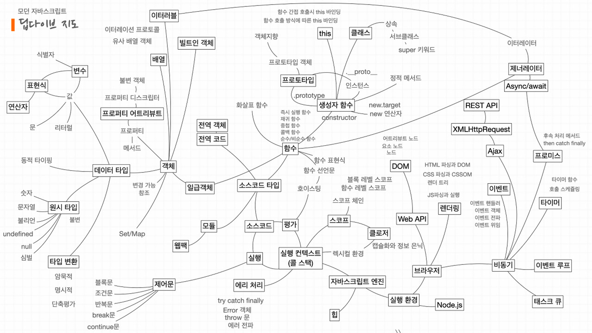

# 스터디 일정 계획

## 《이웅모의 자바스크립트 Deep Dive》

## 진행방식

- 공부한내용 + 질문 + 새로알게된 내용 + 인상 깊은 점 + 이야기해보고싶은 내용
- 모든 내용을 말하는 것보다는 각 주차에 챕터를 역할분담해서 자기가 맡은 챕터를 사람들에게 알려주는 방식
- 기본적으로 모든 사람은 챕터에 대해서 정리해두어야 함
- 각 주차의 서기가 해당 내용을 기록해 md 파일 작성후 PR

## 주차별 일정 계획(연관성 있는 주차별로 끊었습니다)

할일

- 다 읽는데 각자 맡은 파트는 설명 가능하도록(어깨뽕, 난 최고야)
- 러버덕 발표 10 ~ 15분
- 모이는 날 서로 발표하면서 주고받은 대화 내용을 파일 하나에 넘어가면서 기록 - 저장

- 타입스크립트 : 내용 읽으면서 질문(답할 수 있는)을 2개 해서 스터디 하기 5분 전에 올려서 랜덤 뽑고 기자회견

### 1주차(10분)

4장 : 변수 - 지현

5장 : 표현식과 문 - 지훈

6장 : 데이터 타입 - 세영

7장 : 연산자 - 유정

8장 : 제어문 - 수종

### 2주차

9 - 타입변환 : 수종

9 - 단축평가 : 지훈

10 - 객체리터럴 : 지현

11 - 원시값 : 유정 

11 - 객체  : 세영

### 3주차

10 - 객체리터럴 : 지현

12- 함수(1,2,3,4) - 지훈

12 -함수(5,6,7) - 수종

13- 스코프 - 세영

14- 전역변수의 문제점 - 수종

### 4주차

15장 - 세영

16장 - 지현

17장 - 유정

react -지훈

자유주제 - 수종(언제 해올거야)

### 5주차

18장- 유정

19장 5,6,7 - 지훈 , 세영

19장 8,9,10 - 지현

19장 11,12,13,14 - 수종

### 6주차

20,21,22장

### 7주차

23,24장

### 8주차

25,26장

### 9주차

27,28,29장

### 10주차

30,31,32장

### 11주차

33,34,35,36장

### 12주차

37,38,39장

### 13주차

40,41장

### 14주차

42,43,44,45,46장

### 15주차

47,48,49장

## 《댄 밴더캄의 Effective Typescript》

| 주차 | 학습 | 학습 범위 |
| --- | --- | --- |
| 1주차 | 1장~2장 | 타입스크립트 알아보기 / 타입스크립트의 타입 시스템(item1 ~ 8) (p.1 ~ 52) |
| 2주차 | 2장 | 타입스크립트의 타입 시스템(item5 ~ 8) |
| 3주차 | 2장 | item 9, 10 |
| 4주차 | 2장 | item 11, 12 |
| 5주차 | 2장 | item 13, 14 |

- 목차

  > 1장 타입스크립트 알아보기
  >
    - 아이템 1 타입스크립트와 자바스크립트의 관계 이해하기
    - 아이템 2 타입스크립트 설정 이해하기
    - 아이템 3 코드 생성과 타입이 관계없음을 이해하기
    - 아이템 4 구조적 타이핑에 익숙해지기
    - 아이템 5 any 타입 지양하기

  > 2장 타입스크립트의 타입 시스템
  >
    - 아이템 6 편집기를 사용하여 타입 시스템 탐색하기
    - 아이템 7 타입이 값들의 집합이라고 생각하기
    - 아이템 8 타입 공간과 값 공간의 심벌 구분하기
    - 아이템 9 타입 단언보다는 타입 선언을 사용하기
    - 아이템 10 객체 래퍼 타입 피하기
    - 아이템 11 잉여 속성 체크의 한계 인지하기
    - 아이템 12 함수 표현식에 타입 적용하기
    - 아이템 13 타입과 인터페이스의 차이점 알기
    - 아이템 14 타입 연산과 제너릭 사용으로 반복 줄이기
    - 아이템 15 동적 데이터에 인덱스 시그니처 사용하기
    - 아이템 16 number 인덱스 시그니처보다는 Array, 튜플, ArrayLike를 사용하기
    - 아이템 17 변경 관련된 오류 방지를 위해 readonly 사용하기
    - 아이템 18 매핑된 타입을 사용하여 값을 동기화하기

  > 3장 타입 추론
  >
    - 아이템 19 추론 가능한 타입을 사용해 장황한 코드 방지하기
    - 아이템 20 다른 타입에는 다른 변수 사용하기
    - 아이템 21 타입 넓히기
    - 아이템 22 타입 좁히기
    - 아이템 23 한꺼번에 객체 생성하기
    - 아이템 24 일관성 있는 별칭 사용하기
    - 아이템 25 비동기 코드에는 콜백 대신 async 함수 사용하기
    - 아이템 26 타입 추론에 문맥이 어떻게 사용되는지 이해하기
    - 아이템 27 함수형 기법과 라이브러리로 타입 흐름 유지하기

  > 4장 타입 설계
  >
    - 아이템 28 유효한 상태만 표현하는 타입을 지향하기
    - 아이템 29 사용할 때는 너그럽게, 생성할 때는 엄격하게
    - 아이템 30 문서에 타입 정보를 쓰지 않기
    - 아이템 31 타입 주변에 null 값 배치하기
    - 아이템 32 유니온의 인터페이스보다는 인터페이스의 유니온을 사용하기
    - 아이템 33 string 타입보다 더 구체적인 타입 사용하기
    - 아이템 34 부정확한 타입보다는 미완성 타입을 사용하기
    - 아이템 35 데이터가 아닌, API와 명세를 보고 타입 만들기
    - 아이템 36 해당 분야의 용어로 타입 이름 짓기
    - 아이템 37 공식 명칭에는 상표를 붙이기

  > 5장 any 다루기
  >
    - 아이템 38 any 타입은 가능한 한 좁은 범위에서만 사용하기
    - 아이템 39 any를 구체적으로 변형해서 사용하기
    - 아이템 40 함수 안으로 타입 단언문 감추기
    - 아이템 41 any의 진화를 이해하기
    - 아이템 42 모르는 타입의 값에는 any 대신 unknown을 사용하기
    - 아이템 43 몽키 패치보다는 안전한 타입을 사용하기
    - 아이템 44 타입 커버리지를 추적하여 타입 안전성 유지하기

  > 6장 타입 선언과 @types
  >
    - 아이템 45 devDependencies에 typescript와 @types 추가하기
    - 아이템 46 타입 선언과 관련된 세 가지 버전 이해하기
    - 아이템 47 공개 API에 등장하는 모든 타입을 익스포트하기
    - 아이템 48 API 주석에 TSDoc 사용하기
    - 아이템 49 콜백에서 this에 대한 타입 제공하기
    - 아이템 50 오버로딩 타입보다는 조건부 타입을 사용하기
    - 아이템 51 의존성 분리를 위해 미러 타입을 사용하기
    - 아이템 52 테스팅 타입의 함정에 주의하기

  > 7장 코드를 작성하고 실행하기
  >
    - 아이템 53 타입스크립트 기능보다는 ECMAScript 기능을 사용하기
    - 아이템 54 객체를 순회하는 노하우
    - 아이템 55 DOM 계층 구조 이해하기
    - 아이템 56 정보를 감추는 목적으로 private 사용하지 않기
    - 아이템 57 소스맵을 사용하여 타입스크립트 디버깅하기

  > 8장 타입스크립트로 마이그레이션하기
  >
    - 아이템 58 모던 자바스크립트로 작성하기
    - 아이템 59 타입스크립트 도입 전에 @ts-check와 JSDoc으로 시험해 보기
    - 아이템 60 allowJs로 타입스크립트와 자바스크립트 같이 사용하기
    - 아이템 61 의존성 관계에 따라 모듈 단위로 전환하기
    - 아이템 62 마이그레이션의 완성을 위해 noImplicitAny 설정하기

---

## <Javascript Coding Test - TBD>

1. 백준 or 프로그래머스 or 구름 등등 플랫폼 정해서 낮은단계부터 1일 1코테로 풀기

1. 기본은 알아서 하구 아래 리스트를 차근차근 공부해서 코테풀고 공유하기,
    1. for 문, 이중 for 문으로 문제풀기
    2. javascript 내장함수로 문제풀기
    3. 문자열 탐색
    4. 완전탐색(브루트포스)
    5. 효율성(투포인터 알고리즘, 슬라이딩윈도우, 해쉬)
    6. 자료구조(스택, 큐)
    7. 정렬과 그리디, 결정알고리즘(이분검색)
    8. 재귀함수와 완전탐색(DFS:깊이우선탐색)
    9. 그래프와 탐색(DFS, BFS:너비우선탐색, 다익스트라)
    10. Dynamic programming(동적계획법)

2. 1번과 2번을 믹스해서 하기
